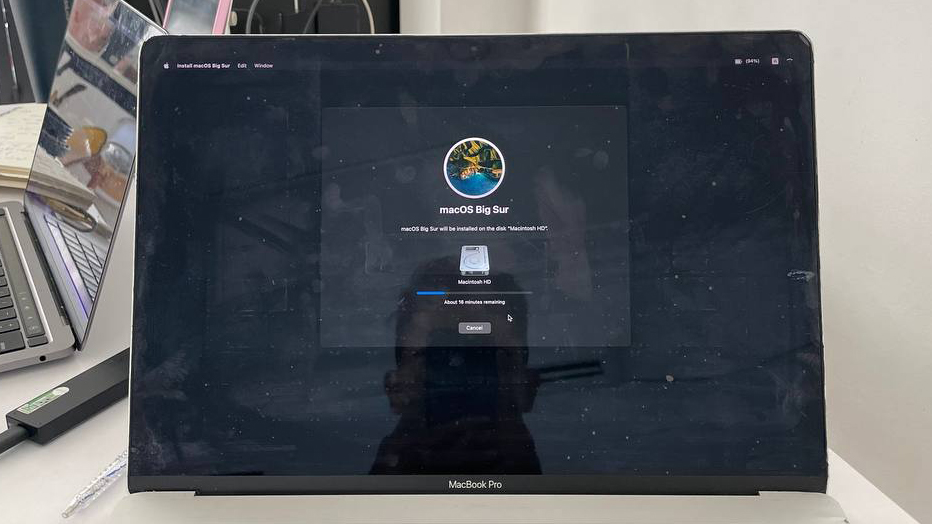
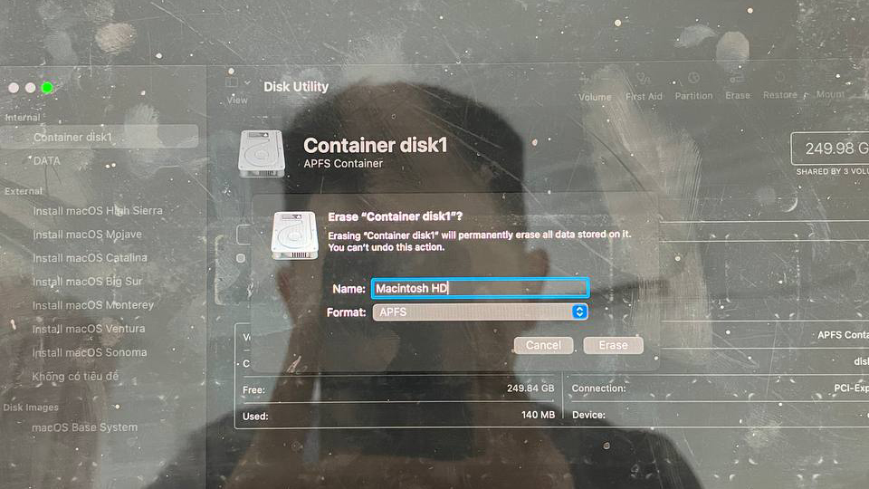
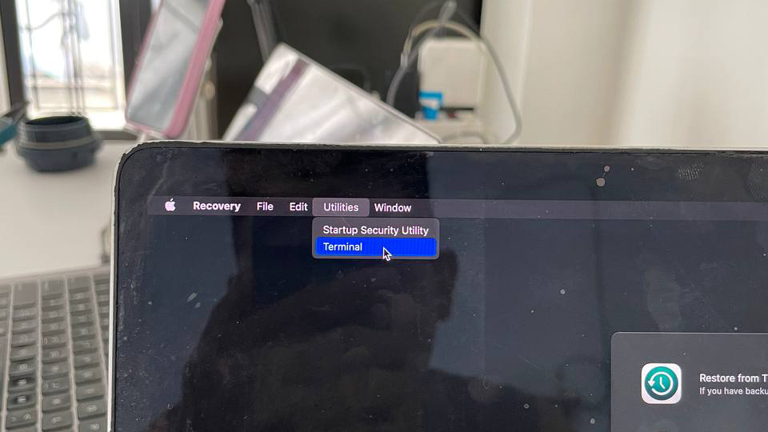
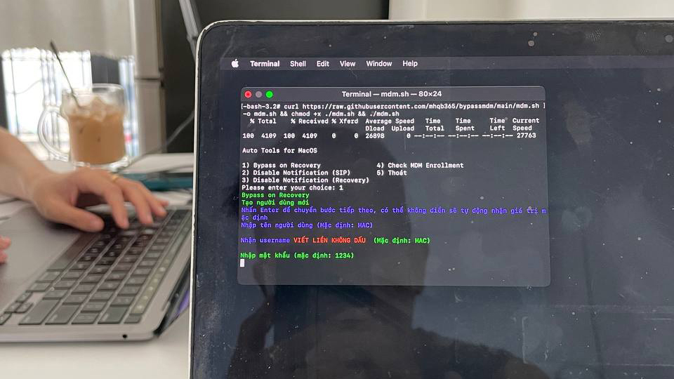
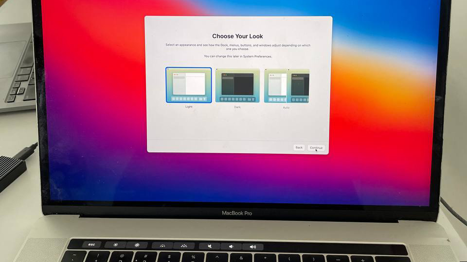

> MacBook MDM là gì: https://chatgpt.com/share/67959333-7c14-8002-8d88-30629fdb607b

# Hướng dẫn Bypass MDM các dòng MacBook không can thiệp phần cứng

> Dùng được cho cả chip Intel lẫn chip M

## Tuyên bố miễn trừ trách nhiệm

> Tui (mhqb365) là chủ sở hữu của những đoạn code trên, những đoạn code trên được fork về từ maclifevn và có chỉnh sửa một xíu. Tôi tuyên bố sẽ miễn trừ trách nhiệm khi bạn sử dụng những đoạn code này

Bạn có quyền sử dụng nó tùy ý, tuy nhiên xin lưu ý rằng trong mọi trường hợp, khi bạn sử dụng những đoạn code trên cho những mục đích xấu, sửa đổi hoặc những việc tương tự nhằm mục đích gây hại cho những cá nhân, tổ chức khác, bạn sẽ phải chịu trách nhiệm cho những việc đó. Tôi sẽ không phải chịu bất cứ trách nhiệm gì từ việc này

Chúc bạn sử dụng code vui vẻ

## Bước 1. Cài lại MacOS



> Khi cài nhớ format ổ đĩa với tên là ```Macintosh HD``` để không gặp lỗi ở Bước 3



## Bước 2. Vào Recovery

> Đè nút nguồn cho máy tắt hẳn sau đó đưa máy vào Recovery

> Chip Intel: bấm nút nguồn rồi nhanh tay giữ tổ hợp phím ```Command``` + ```R```, khi thấy logo táo và thanh loading thì thả tay

> Chip M: đè nút nguồn đến khi thấy dòng chữ ```Loading Startup Options``` thì thả tay ra, load xong thì chọn ```Options```

## Bước 3. Bypass

> Vào được Recovery thì mở Safari và truy cập địa chỉ: https://j2c.cc/mdm

> Bạn sẽ gặp lại bài viết này, hãy copy đoạn mã dưới đây:

```sh
curl https://raw.githubusercontent.com/mhqb365/bypassmdm/main/bypass.sh -o bypass.sh && chmod +x ./bypass.sh && ./bypass.sh
```



> Tắt Safari đi và mở mở Terminal lên

> Dán đoạn mã vừa copy vào rồi Enter, bảng công cụ sẽ hiện lên, nhập vào số 1 và Enter



> Nhập tên tài khoản + tên username + mật khẩu bạn muốn vào hoặc cứ Enter 3 lần để đặt theo mặt định (tk: mac / mk: 1234)

> Thấy dòng chữ ```Bypass thành công``` thì khởi động lại hoặc gõ ```reboot``` vào Terminal rồi Enter cho lẹ

### Tận hưởng thành quả thôi, chúc các bạn thành công!



Nguồn: maclife.io

# Kiểm tra MacBook của bạn có phải máy MDM hay không?

## Cách 1:

> Copy dòng lệnh sau và bỏ vào Terminal:

```sh
profiles status -type enrollment
```

> Nếu Terminal hiển thị ```Enrolled via DEP``` hoặc ```MDM enrollment``` thì là máy MDM rồi đấy

> Nhược điểm là độ chính xác ở mức tương đối

## Cách 2:

> Cài lại MacOS, đến bước active MacOS, nếu máy đòi đăng nhập tk công ty hoặc hiển thị cửa sổ ```Remote Management``` thì đúng máy MDM rồi


## Goodluck