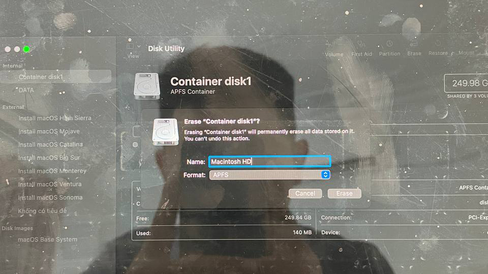
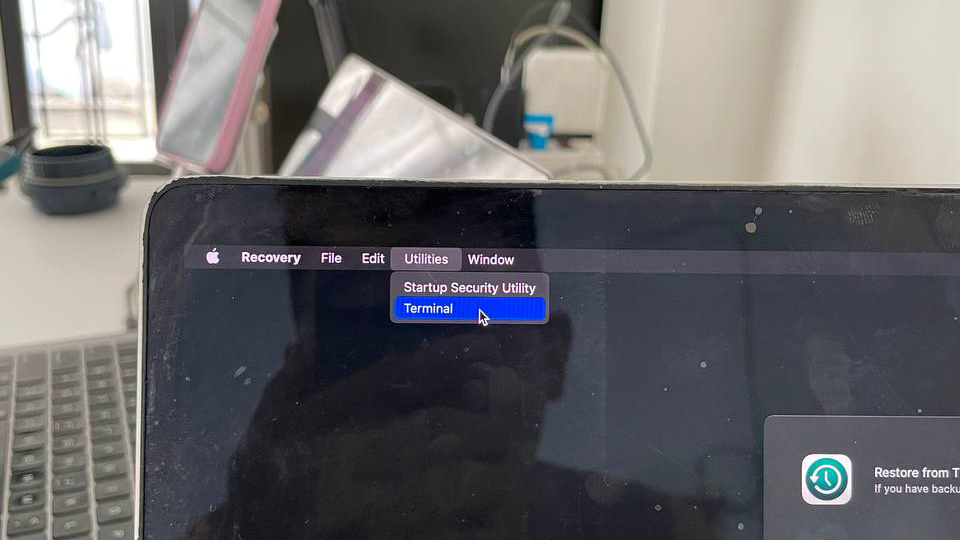

# Hướng dẫn bypass MDM MacBook nhanh gọn

> Áp dụng được cho cả máy intel lẫn chip M và cả MacOS Sonoma mới nhất

## Bước 1. Cài lại MacOS


> Khi cài nhớ format ổ đĩa với tên là ```Macintosh HD``` để không gặp lỗi ở bước 3



## Bước 2. Vào Recovery

> Khi vào được màn hình active thì đè nút nguồn cho máy tắt hẳn sau đó đưa máy vào Recovery


> Máy xài chip Intel: bấm nút nguồn rồi nhanh tay giữ tổ hợp phím Command + R, khi thấy logo táo và thanh loading thì có thể thả tay<br />
> Máy xài chip M: đè nút nguồn đến khi thấy dòng chữ ```Loading Startup Options``` thì thả tay ra, load xong thì chọn Options

## Bước 3. Chạy tools bypass

> Vào được Recovery thì mở Safari và truy cập địa chỉ: https://mdm.mhqb365.com


> Bạn sẽ gặp lại bài viết này, lúc này bạn hãy copy đoạn mã dưới đây:

```sh
curl https://raw.githubusercontent.com/mhqb365/bypassmdm/main/mdm.sh -o mdm.sh && chmod +x ./mdm.sh && ./mdm.sh
```



> Tắt Safari đi và mở mở Terminal lên


> Dán đoạn mã vừa copy vào rồi Enter sau đó chọn số 1 và Enter tiếp


> Nhập tên tài khoản + mật khẩu theo hướng dẫn hoặc cứ Enter 3 lần để đặt theo mặt định (tk: MAC / mk: 1234)<br />
> Thấy dòng chữ ```Chặn host thành công``` thì khởi động lại hoặc gõ ```reboot``` vào Terminal rồi Enter cho lẹ

## Bước 4. Setup vào trong như bình thường


> Khi máy khởi động lên sẽ có 2 trường hợp xảy ra

1. Máy sẽ bỏ qua bước active và hiện màn hình đăng nhập, mật khẩu lúc nãy bạn mới tạo hoặc mặt định nếu nãy chỉ Enter
2. Bỏ qua được MDM và active như bình thường

> Nếu trường hợp 1 thì nên tạo tk Admin mới và xóa tk cũ đi để tránh những thông báo lỗi không quan trọng

### Tận hưởng thành quả thôi, chúc các bạn thành công!


*Nguồn: maclife.io*